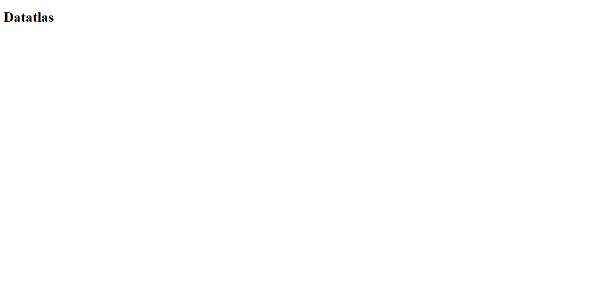

	

		
	

---
El Club Atletisme Atlas nace fruto de una voluntad de crecimiento y expansión por parte de un pequeño grupo de apasionados del atletismo. Sergi Garcia, Valentín Gartner y Daniel Espada, técnicos de la sección de Atletismo en el CE Sant Josep Obrer, mostraron su determinación y convicción para crear algo nuevo con identidad propia y con una capacidad de expansión ilimitada.

En verano de 2022, acompañados por Ramón Manzano y Paco Blasco, e inspirados por la ilusión y la energía de un buen puñado de niños y jóvenes, su idea sobrevino en proyección, ideas y toma de decisiones, y tras seis meses de gestiones y trámites, Atlas se convirtió en realidad.

¿Qué pinto yo en todo esto? Daniel Espada lleva siendo mi entrenador desde hace más de una década y, unos años antes del nacimiento de este club, fui también técnico en el CE Sant Josep Obrer.

## Precedentes

Durante el 2023 estuve registrando los resultados de los atletas del club en una hoja de cálculo y así poder generar con facilidad ránkings internos, ver quién tiene los récords del club, obtener un listado de los registros de cada atleta o calcular el coste que ha supuesto competir en cada uno de los eventos realizados.

	

Prácticamente todos los datos se introducían a mano en la tabla maestra, a excepción de las tres últimas columnas que se calculaban con fórmulas y datos provenientes de otras tablas. También podemos observar un código de color condicional para que un humano pueda ver con facilidad la validez de las marcas.

	

Basta con lo que he dicho para saber que nada de esto estaba normalizado, incluso se guardaban algunos campos extraños y repetitivos, como la forma en la que la hoja de cálculo tenía que formatear los resultados según la prueba o las unidades métricas de dichos resultados (distancia, tiempo, puntos).

	

Sin embargo, llegué a diseñar hasta cuatro interfaces dentro de la propia hoja de cálculo, para mostrar los datos de forma filtrada y ordenada según las necesidades comentadas al inicio de este apartado.

	

Durante un periodo de tiempo largo, la base de datos del club prácticamente no se actualizó. Como empecé a estudiar, no tenía tiempo de dedicarme a introducir las marcas de las competiciones semanales, así como tampoco acudía a entrenar.

## Día cero

Al empezar a trabajar por las mañanas y tener jornada de clase reducida, algunas tardes iba a entrenar con el equipo. En uno de estos entrenos, el tesorero del club me pidió si podía introducir las marcas de la temporada 2024 en la hoja de cálculo. Lo empecé a hacer, hasta que me dí cuenta de las carencias del trabajo que hice casi un año atrás.

Le comenté al secretario del club qué le parecía la idea de convertir esas interfaces de usuario en algo más accesible, no solo por los entrenadores, sino por los atletas. Una página web que llamara a la API de Google Sheets. Esa misma noche nos pusimos a trabajar en ello.

Creamos un proyecto en Google Cloud con un usuario que tuviera acceso a las hojas de cálculo, datatlas (data + Atlas). Nos dimos cuenta de que este usuario podría modificar los datos, así que intentamos quitarle permisos, sin éxito. Finalmente, creamos otro usuario: __datatlas2__.

Cabe decir que también empezamos a hacer una web, en html puro, que se veía más o menos así:

	

## Día uno

Hasta entonces yo había utilizado React Native para hacer alguna app que instalaba en mi smartphone Android con una APK. Para este proyecto también quería usar React, así que investigué hasta encontrar Next JS.

Con un framework como Next JS podíamos hacer una Aplicación Web Progresiva (PWA) que se renderice en el servidor (SSR) sin que eso perjudique al posicionamiento (SEO) ni al rendimiento. Con esto, los usuarios tienen la opción de crear un acceso directo en su dispositivo para visualizarla como si fuera una aplicación nativa.

En un solo día creé una landing page para enseñarle el proyecto a quién la noche anterior estuvo trabajando conmigo: Valentín. Simplemente le encantó y me motivó a seguir trabajando en ello, teniendo un par de reuniones a lo largo del tiempo para mostrarle los avances y recibir feedback de parte de alguien tan importante para el club, y para mí.

	

## Día quince

Tras dos semanas de echarle horas a este proyecto a la vez que iba a trabajar en la empresa, tuvimos otra reunión. En esta ocasión llamamos a Antonio, un genio de la informática, para comentarle la situación en la que estábamos.

> Antonio, ayuda. ¿Cómo hacemos un deploy de esta cosa?

Primero valoramos hacerlo con Vercel, una plataforma de los desarrolladores de Next JS que permite publicar una aplicación web hecha en este framework, entre otros. Pero por qué hacerlo así cuando podemos configurar un servidor que ya teníamos: el que aloja la web del club.

Hicimos un subdominio de la web con Cloudflare, creamos un webhook en Github que manda una solicitud POST al servidor cada vez que se hace un nuevo commit (para que un script haga pull al repositorio y luego build de la aplicación actualizada).

Seis horas después y un par de arreglos que tuve que hacer en el último momento (cosas que funcionaban en development pero no en deployment), la aplicación estaba publicada, funcional y se actualizaría cada vez que hiciera algún cambio.

## Consecuentes

